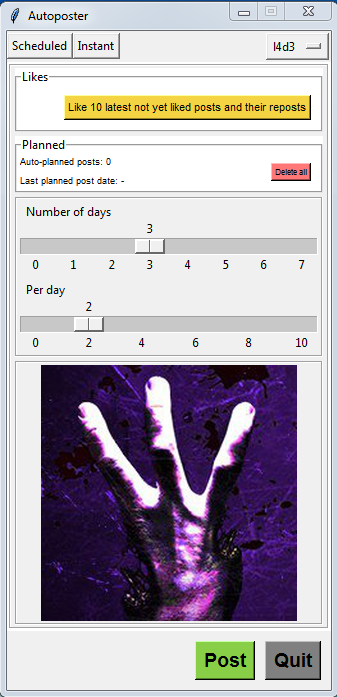
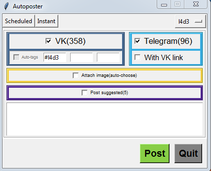

# Autoposter

##What is it
A semi-automatic VK/Telegram posting desktop Windows application.

##Features
* Automatically-generated queues of images to pe postd in VK and/or Telegram
* 2 modes of work: _scheduled_ and _instant_, - for different types of posts, respectively
* Possibility to add "Likes" to posts and their reposts automatically
* Possibility to set frequency of scheduled posts
* Possibility to delete all scheduled posts
* Multiple projects' support
* Possibility to post custom text to VK or/and Telegram
* User-friendly interface

##Instructions
The interface is not finished yet, so it is required to have some knowledge of databases to start using the application.
1. Run "Autoposter.exe" to initialize the DB
2. Register a standalone VK application  
https://vk.com/editapp?act=create
3. Open "structure.db" with some DB management application and fill the tables with your info
4. Start using the app

##Screenshots

